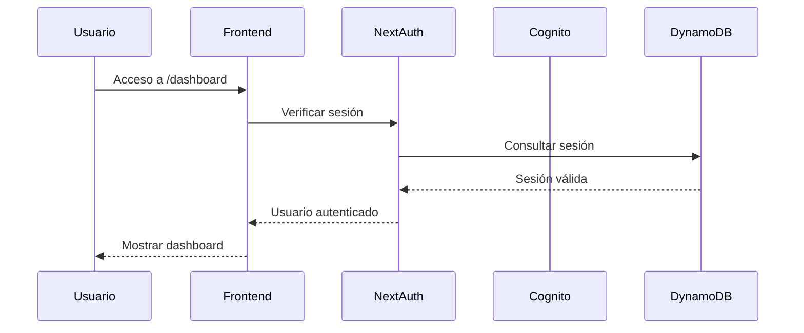
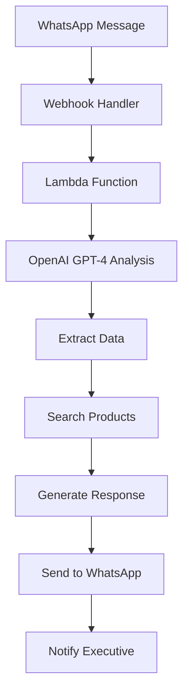
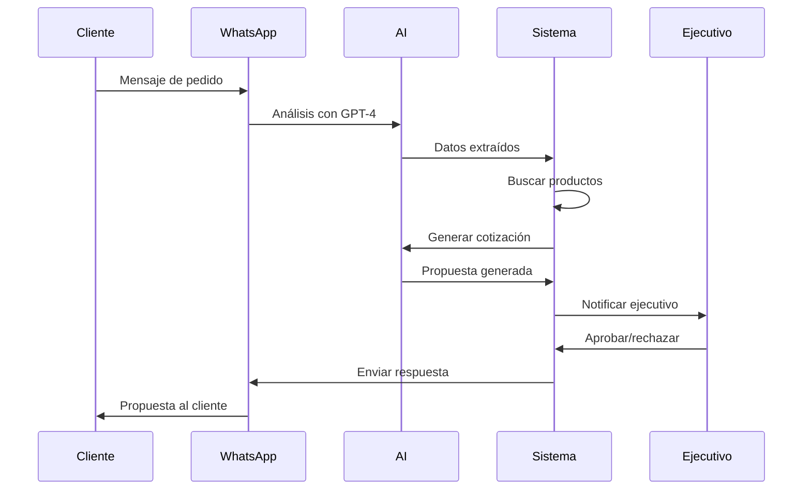

# Arquitectura del Sistema - OnPoint Admin

## 🏗️ Visión General

OnPoint Admin es una plataforma integral de ventas B2B que automatiza el proceso completo desde WhatsApp hasta PDF final, con IA integrada para análisis de peticiones y generación automática de propuestas comerciales.

## 🎯 Objetivos del Sistema

- **Automatización**: Procesamiento automático de mensajes de WhatsApp
- **IA Integrada**: Análisis inteligente de peticiones y generación de contenido
- **Escalabilidad**: Arquitectura serverless para manejar picos de tráfico
- **Seguridad**: Autenticación robusta con AWS Cognito
- **Performance**: CDN y optimizaciones para carga rápida

## 🏛️ Arquitectura de Alto Nivel

```
┌─────────────────┐    ┌─────────────────┐    ┌─────────────────┐
│   Frontend      │    │   Backend       │    │  Infraestructura│
│   (NextJS 14)   │    │   (API Routes)  │    │   (AWS)         │
├─────────────────┤    ├─────────────────┤    ├─────────────────┤
│ • React 18      │    │ • NextAuth.js   │    │ • DynamoDB      │
│ • TypeScript    │    │ • API Routes    │    │ • S3 + CloudFront│
│ • Tailwind CSS  │    │ • Middleware    │    │ • Lambda        │
│ • Shadcn/ui     │    │ • Validation    │    │ • API Gateway   │
│ • Zustand       │    │ • AI Services   │    │ • SQS           │
└─────────────────┘    └─────────────────┘    └─────────────────┘
```

## 🔧 Stack Tecnológico

### Frontend
- **NextJS 14**: Framework principal con App Router
- **React 18**: Biblioteca de UI con hooks modernos
- **TypeScript**: Tipado estático para mayor robustez
- **Tailwind CSS**: Framework CSS utility-first
- **Shadcn/ui**: Componentes UI profesionales
- **React Hook Form**: Manejo eficiente de formularios
- **Zod**: Validación de schemas
- **Zustand**: Estado global ligero
- **Lucide React**: Iconografía consistente

### Backend
- **NextJS API Routes**: Endpoints RESTful
- **NextAuth.js v4**: Autenticación y autorización
- **AWS SDK v3**: Integración con servicios AWS
- **DynamoDB**: Base de datos NoSQL principal
- **S3**: Almacenamiento de archivos
- **CloudFront**: CDN para archivos estáticos

### IA y Procesamiento
- **OpenAI GPT-4**: Análisis de peticiones de WhatsApp
- **Claude 3.5 Sonnet**: Generación de contenido comercial
- **Puppeteer**: Generación de PDFs desde HTML
- **Sharp**: Procesamiento de imágenes

### Integraciones Externas
- **WhatsApp Business API**: Recepción/envío de mensajes
- **Meta Graph API**: Manejo de webhooks
- **Resend**: Envío de emails transaccionales
- **Amazon Cognito**: Identity provider

## 🗄️ Arquitectura de Datos

### DynamoDB - Tablas Principales

```typescript
// Tabla: onpoint_providers
{
  PK: "PROVIDER#<id>",
  SK: "PROFILE",
  name: string,
  description?: string,
  logo?: string,
  website?: string,
  email: string,
  phone?: string,
  rating: number,
  isActive: boolean,
  createdAt: string,
  updatedAt: string
}

// Tabla: onpoint_products
{
  PK: "PRODUCT#<id>",
  SK: "PROFILE",
  providerId: string,
  name: string,
  description?: string,
  category: string,
  variants: ProductVariant[],
  pricing: PricingTier[],
  stock: StockInfo,
  isActive: boolean,
  createdAt: string,
  updatedAt: string
}

// Tabla: onpoint_whatsapp_messages
{
  PK: "MESSAGE#<id>",
  SK: "PROFILE",
  messageId: string,
  from: string,
  to: string,
  type: MessageType,
  content: string,
  mediaUrl?: string,
  aiAnalysis?: AIAnalysis,
  status: MessageStatus,
  createdAt: string,
  updatedAt: string
}
```

### S3 - Estructura de Archivos

```
onpoint-storage/
├── logos/
│   ├── providers/
│   │   └── <provider-id>/
│   │       └── logo.png
│   └── clients/
│       └── <client-id>/
│           └── logo.png
├── products/
│   └── <product-id>/
│       ├── images/
│       └── mockups/
├── proposals/
│   └── <proposal-id>/
│       ├── pdf/
│       └── assets/
└── temp/
    └── uploads/
```

## 🔐 Seguridad y Autenticación

### Flujo de Autenticación



### Control de Acceso (RBAC)

```typescript
enum Role {
  ADMIN = 'admin',        // Acceso completo
  EJECUTIVO = 'ejecutivo', // Gestión de ventas
  CLIENTE = 'cliente'     // Solo visualización
}

// Middleware de protección de rutas
const protectedRoutes = {
  '/admin': [Role.ADMIN],
  '/providers': [Role.ADMIN, Role.EJECUTIVO],
  '/products': [Role.ADMIN, Role.EJECUTIVO],
  '/dashboard': [Role.ADMIN, Role.EJECUTIVO, Role.CLIENTE]
}
```

## 🤖 Arquitectura de IA

### Flujo de Procesamiento de WhatsApp



### Servicios de IA

```typescript
// Análisis de mensajes con GPT-4
interface AIAnalysis {
  extractedData: {
    products?: string[]
    quantities?: number[]
    colors?: string[]
    urgency?: 'low' | 'medium' | 'high'
    budget?: number
  }
  intent: 'quotation' | 'information' | 'complaint' | 'other'
  confidence: number
  suggestedResponse?: string
}

// Generación de contenido con Claude
interface ContentGeneration {
  proposal: string
  email: string
  followUp: string
}
```

## 📊 Módulos del Sistema

### V1 - Módulos Base ✅

#### Autenticación
- NextAuth.js con Cognito
- JWT tokens
- Refresh tokens
- Middleware de protección

#### Gestión de Proveedores
- CRUD completo
- Upload de logos
- Calificación y rendimiento
- Contactos múltiples

#### Gestión de Productos
- CRUD con variantes
- Precios escalonados
- Control de stock
- Import CSV

### V2 - WhatsApp + IA 🔄

#### Procesamiento de Mensajes
- Webhook de WhatsApp
- Análisis con GPT-4
- Extracción de datos
- Respuestas automáticas

#### Sistema de Notificaciones
- Alertas al ejecutivo
- Dashboard en tiempo real
- Historial de conversaciones

### V3 - Cotización Inteligente 📅

#### Algoritmo de Scoring
```typescript
interface ProviderScore {
  providerId: string
  score: number
  factors: {
    price: number        // 30%
    quality: number      // 25%
    stock: number        // 20%
    delivery: number     // 15%
    relationship: number // 10%
  }
}
```

#### Cotizador Automático
- Márgenes configurables
- Descuentos por volumen
- Cálculo de IVA
- Comparación lado a lado

### V4 - Diseño de Propuestas 📅

#### Generación de Mockups
- Upload de logos de clientes
- Aplicación en productos 3D
- Múltiples posiciones
- Renderizado en tiempo real

#### Editor Visual
- Canvas drag & drop
- Templates por tipo de producto
- Biblioteca de elementos

### V5 - Generador de PDFs 📅

#### Plantillas Responsive
- Diseño profesional automático
- Contenido dinámico
- Branding personalizable
- Generación asíncrona

### V6 - Envío y Seguimiento 📅

#### Sistema Multicanal
- WhatsApp directo
- Email con plantillas
- Portal web seguro
- SMS de seguimiento

#### Analytics Avanzado
- Tracking de aperturas
- Tiempo en portal
- Descarga de PDFs
- Feedback del cliente

### V7 - Editor Visual Avanzado 📅

#### Colaboración en Tiempo Real
- Múltiples usuarios
- Sincronización automática
- Historial de versiones
- Rollback automático

## 🚀 Deployment y DevOps

### Entorno de Desarrollo
```bash
npm run dev          # Servidor local
npm run type-check   # Verificación de tipos
npm run lint         # Linting
```

### Entorno de Producción
```bash
npm run build        # Build optimizado
npm run start        # Servidor de producción
```

### AWS Amplify
- Deploy automático desde GitHub
- Variables de entorno en consola
- Build y deploy en la nube
- CDN automático

### Monitoreo
- CloudWatch para logs
- Métricas de performance
- Alertas automáticas
- Dashboard de salud

## 📈 Escalabilidad

### Horizontal
- Lambda functions auto-escalables
- DynamoDB con particionado
- S3 con múltiples regiones
- CloudFront global

### Vertical
- Optimización de queries
- Caching inteligente
- Compresión de assets
- Lazy loading

## 🔄 Flujo de Datos

### Procesamiento de Ventas


## 🛡️ Consideraciones de Seguridad

### Datos Sensibles
- Encriptación en tránsito (HTTPS)
- Encriptación en reposo (DynamoDB)
- Variables de entorno seguras
- Rotación de claves

### Acceso
- Autenticación multi-factor
- Tokens JWT con expiración
- Rate limiting en APIs
- Validación de entrada

### Compliance
- GDPR compliance
- Logs de auditoría
- Retención de datos
- Políticas de privacidad

---

**Arquitectura diseñada para escalar y evolucionar** 🚀
