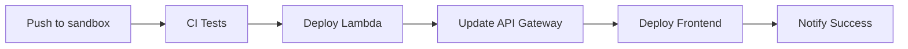
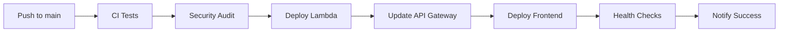

# Configuración de CI/CD con GitHub Actions

## 🚀 Resumen

Este proyecto está configurado con GitHub Actions para despliegues automáticos a sandbox y producción, siguiendo las mejores prácticas de DevOps.

## 📋 Workflows Configurados

### 1. **Continuous Integration (CI)**
- **Archivo**: `.github/workflows/ci.yml`
- **Trigger**: Push y Pull Requests a `main`, `sandbox`, `develop`
- **Funciones**:
  - Linting y type checking
  - Pruebas unitarias con cobertura
  - Auditoría de seguridad
  - Build de la aplicación

### 2. **Deploy to Sandbox**
- **Archivo**: `.github/workflows/deploy-sandbox.yml`
- **Trigger**: Push a `sandbox` o `develop`
- **Funciones**:
  - Despliegue de Lambda functions
  - Actualización de API Gateway
  - Despliegue de frontend a S3
  - Notificaciones de estado

### 3. **Deploy to Production**
- **Archivo**: `.github/workflows/deploy-production.yml`
- **Trigger**: Push a `main` o `production`
- **Funciones**:
  - Despliegue de Lambda functions
  - Actualización de API Gateway
  - Despliegue de frontend a S3
  - Invalidación de CloudFront
  - Health checks post-despliegue
  - Notificaciones de estado

### 4. **Cleanup Resources**
- **Archivo**: `.github/workflows/cleanup.yml`
- **Trigger**: Diario a las 2 AM UTC
- **Funciones**:
  - Limpieza de versiones antiguas de Lambda
  - Limpieza de logs de CloudWatch
  - Mantenimiento automático

## 🔐 Secretos Requeridos

### Para Sandbox
```bash
AWS_ACCESS_KEY_ID
AWS_SECRET_ACCESS_KEY
```

### Para Producción
```bash
AWS_ACCESS_KEY_ID_PROD
AWS_SECRET_ACCESS_KEY_PROD
CLOUDFRONT_DISTRIBUTION_ID
```

### Opcionales
```bash
SNYK_TOKEN  # Para escaneo de seguridad
```

## 🛠️ Scripts de Deployment

### Scripts Principales
- `scripts/deploy-lambda-functions.sh` - Despliega Lambda functions
- `scripts/setup-api-gateway.sh` - Configura API Gateway
- `scripts/run-health-checks.sh` - Ejecuta health checks
- `scripts/setup-production.sh` - Configura entorno de producción

### Scripts de Utilidad
- `scripts/setup-dashboard-tables.sh` - Crea tablas DynamoDB
- `scripts/cleanup-old-resources.sh` - Limpia recursos antiguos

## 📊 Monitoreo y Health Checks

### Health Check Endpoints
- `GET /health` - Health check general del sistema
- `GET /health/dynamodb` - Estado de DynamoDB
- `GET /health/lambda` - Estado de Lambda
- `GET /health/apigateway` - Estado de API Gateway

### Métricas Monitoreadas
- Tiempo de respuesta de servicios
- Disponibilidad de DynamoDB
- Estado de Lambda functions
- Conectividad de API Gateway

## 🔄 Flujo de Deployment

### Sandbox (Desarrollo)


### Producción


## 🧪 Testing

### Pruebas Unitarias
```bash
npm run test              # Ejecutar pruebas
npm run test:watch        # Modo watch
npm run test:coverage     # Con cobertura
```

### Configuración de Jest
- **Archivo**: `jest.config.js`
- **Setup**: `jest.setup.js`
- **Cobertura**: 70% mínimo requerido

## 🔒 Seguridad

### Auditoría de Dependencias
- `npm audit` en cada build
- Escaneo con Snyk (opcional)
- Actualización automática de dependencias

### Permisos IAM
- Mínimos permisos necesarios
- Separación entre sandbox y producción
- Rotación automática de credenciales

## 📈 Métricas y Logging

### CloudWatch Integration
- Logs de todas las Lambda functions
- Métricas de rendimiento
- Alertas automáticas

### GitHub Actions
- Logs detallados de cada step
- Artefactos de build
- Notificaciones de estado

## 🚨 Troubleshooting

### Problemas Comunes

#### 1. **Error de Credenciales AWS**
```bash
# Verificar configuración
aws sts get-caller-identity

# Configurar credenciales
aws configure
```

#### 2. **Error de Permisos IAM**
- Verificar que el usuario tenga los permisos necesarios
- Revisar políticas IAM adjuntas
- Verificar que las credenciales sean correctas

#### 3. **Error de Build**
```bash
# Limpiar cache
npm ci

# Verificar dependencias
npm audit

# Ejecutar tests localmente
npm run test
```

#### 4. **Error de Deployment**
```bash
# Verificar logs de GitHub Actions
# Ejecutar scripts manualmente
./scripts/deploy-lambda-functions.sh sandbox
./scripts/run-health-checks.sh sandbox
```

## 📚 Documentación Adicional

- [Configuración de AWS](docs/aws-integration.md)
- [Arquitectura del Sistema](docs/ARCHITECTURE.md)
- [Guía de Desarrollo](docs/DEVELOPMENT.md)
- [Configuración de Secretos](.github/workflows/setup-secrets.md)

## 🔄 Actualizaciones

### Agregar Nuevo Servicio
1. Crear Lambda function en `lambda-functions/`
2. Agregar a `scripts/deploy-lambda-functions.sh`
3. Configurar en API Gateway
4. Agregar health check
5. Actualizar documentación

### Modificar Workflow
1. Editar archivo en `.github/workflows/`
2. Probar en branch de desarrollo
3. Hacer merge a branch principal
4. Verificar despliegue automático

---

**¡El sistema CI/CD está completamente configurado y listo para usar!** 🚀
